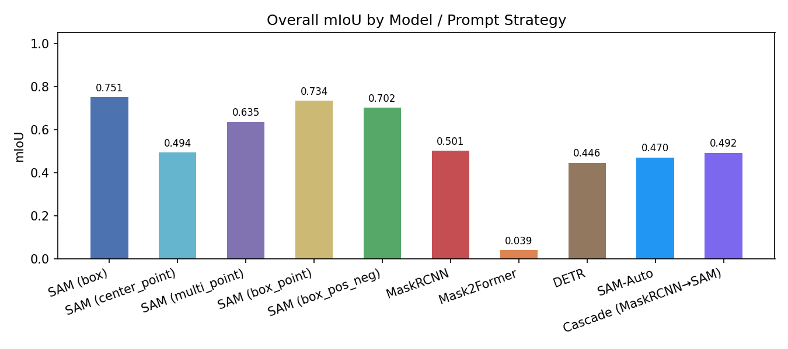
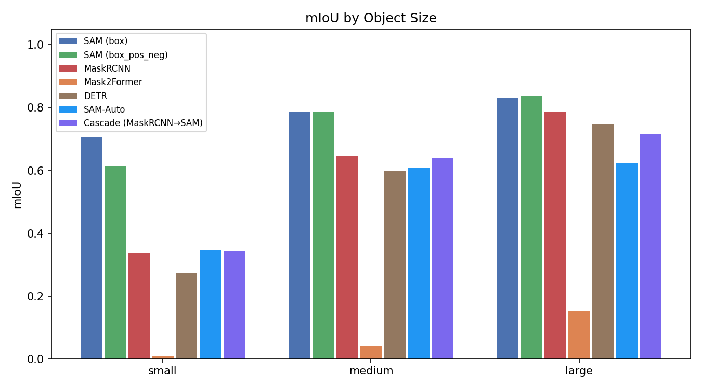
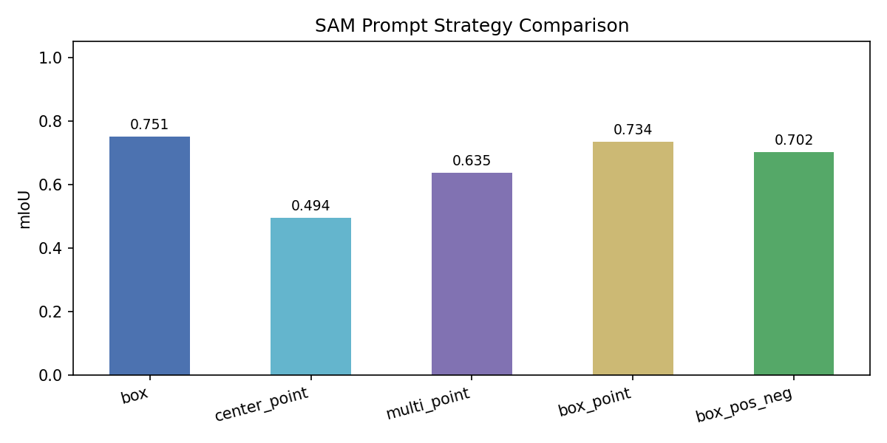
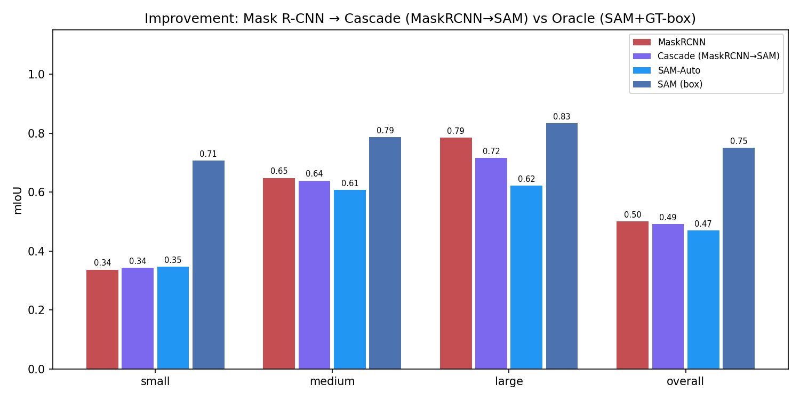
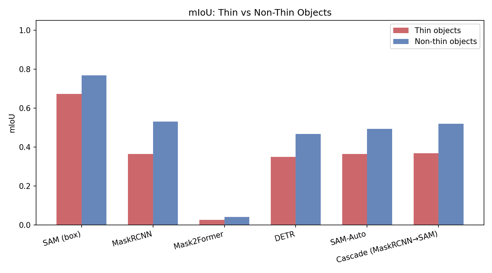
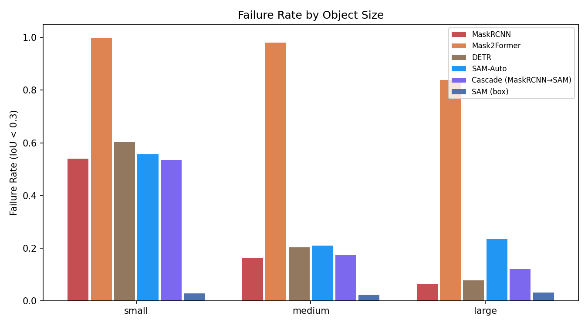
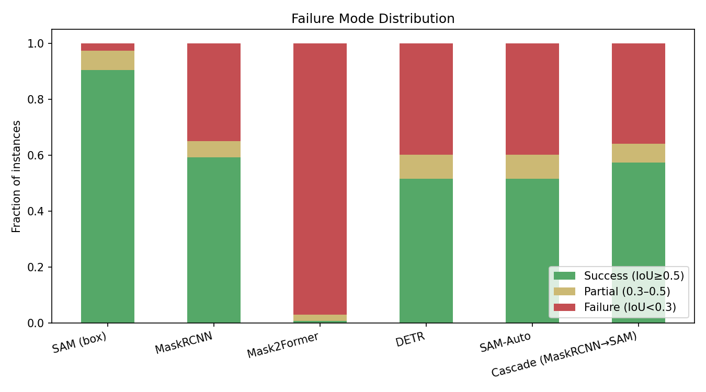
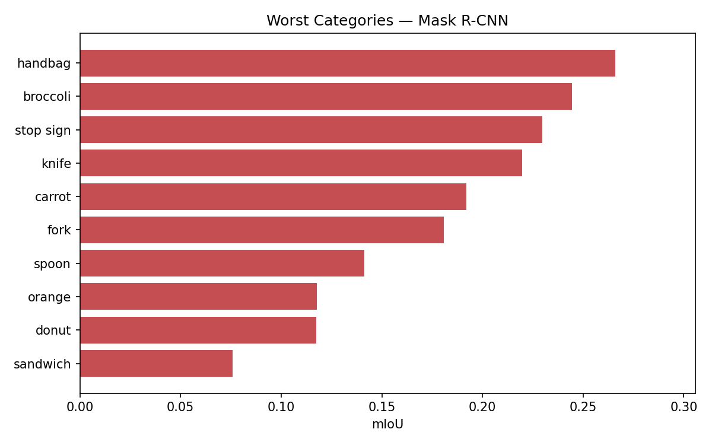
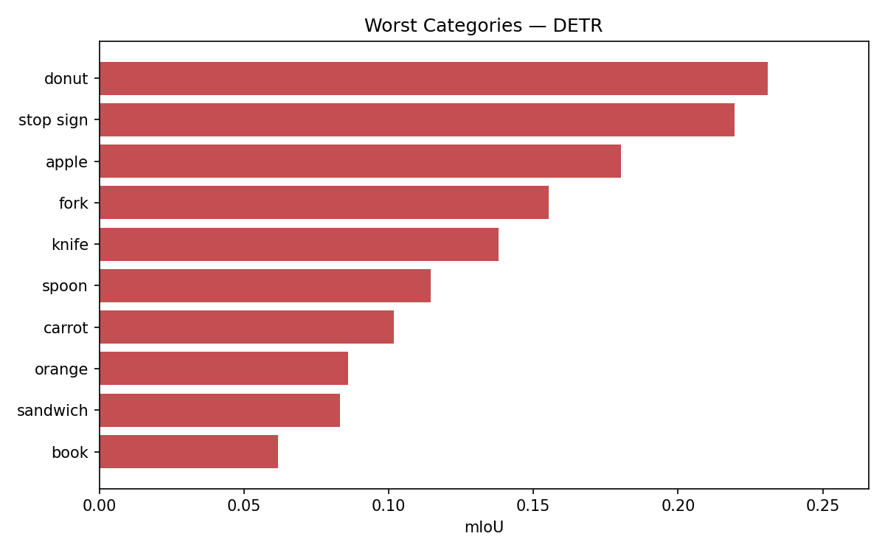
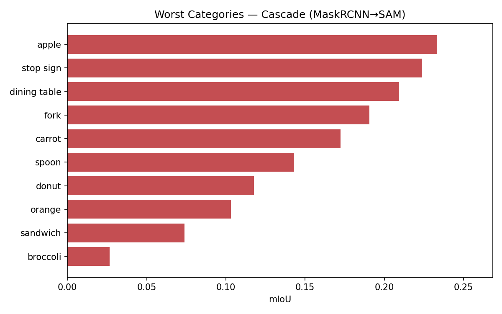

# Benchmarking Instance Segmentation Architectures: Failure Modes and Improvements

**HLCV Course Project** — evaluating six instance segmentation models on COCO val2017 with
per-category and per-size failure analysis, and two implemented improvements.

> Full written analysis: [report/report.md](report/report.md)

---

## Results Summary

Evaluated on a balanced 200-image subset of COCO val2017 — **2,754 instances total**.  
**mIoU** = mean IoU over all ground-truth instances; unmatched GT counts as IoU = 0.

| Model | mIoU | Success rate | Failure rate | Small | Medium | Large | Thin |
|---|---|---|---|---|---|---|---|
| SAM (box, GT-guided) | **0.751** | **0.905** | 0.026 | 0.707 | 0.786 | 0.833 | 0.673 |
| SAM (box\_point) | 0.734 | 0.875 | 0.044 | 0.687 | 0.770 | 0.825 | 0.641 |
| SAM (box\_pos\_neg) | 0.702 | 0.820 | 0.058 | 0.615 | 0.786 | 0.836 | 0.618 |
| SAM (multi\_point) | 0.635 | 0.731 | 0.166 | 0.529 | 0.752 | 0.771 | 0.539 |
| **Mask R-CNN** | **0.501** | 0.592 | 0.350 | 0.337 | 0.648 | 0.785 | 0.364 |
| SAM (center\_point) | 0.494 | 0.540 | 0.319 | 0.512 | 0.493 | 0.427 | 0.439 |
| **Cascade** (MaskRCNN→SAM) | **0.492** | 0.574 | 0.359 | 0.343 | 0.639 | 0.716 | 0.368 |
| **SAM-Auto** (no GT) | **0.470** | 0.516 | 0.398 | 0.347 | 0.607 | 0.622 | 0.365 |
| **DETR** | **0.446** | 0.517 | 0.399 | 0.275 | 0.597 | 0.747 | 0.350 |
| Mask2Former† | 0.039 | 0.008 | 0.970 | — | — | — | — |

†  Mask2Former is excluded from the main analysis. Despite its reported 51.1 AP on COCO,
the HuggingFace checkpoint gives mIoU = 0.039 in our environment (transformers 4.46.3 +
Python 3.8) due to a class-score / mask-quality decoupling that is a library compatibility
issue, not a preprocessing error. See [report/report.md §10](report/report.md) for the
full diagnostic.

### Key findings

- **Prompting gap:** oracle SAM (`box`, 0.751) vs realistic deployment SAM-Auto (0.470) = **−0.281 mIoU**. In real deployment SAM merely matches classic baselines.
- **Cascade:** MaskRCNN→SAM refinement helps small objects (+0.006) but hurts large (−0.069); best applied selectively, not globally.
- **Small objects are the dominant failure mode** — Mask R-CNN falls 57% from large (0.785) to small (0.337); DETR falls 63%.
- **Worst categories:** food items (sandwich 0.076, donut 0.117, orange 0.118) and thin utensils (spoon 0.141, fork 0.181) across all CNN models.

---

## Figures

### Overall mIoU


### mIoU by Object Size


### SAM Prompt Strategy Comparison


### Improvement Comparison (MaskRCNN → Cascade → SAM-Auto → SAM GT)


### Thin vs Non-Thin Objects


### Failure Rate by Object Size


### Failure Mode Breakdown


### Worst Categories — Mask R-CNN


### Worst Categories — DETR


### Worst Categories — Cascade


---

## Project Overview

### Architecture families evaluated

| Model | Architecture | Source | Notes |
|---|---|---|---|
| Mask R-CNN | CNN + FPN + RoIAlign | torchvision (COCO\_V1) | Baseline |
| Mask2Former | Transformer (masked-attention) | HF `mask2former-swin-base-coco-instance` | Excluded† |
| DETR | Transformer (bipartite matching) | HF `detr-resnet-50-panoptic` | Things only |
| SAM | ViT + prompt encoder | SAM ViT-B checkpoint | 5 prompt strategies |
| SAM-Auto | SAM automatic grid | same checkpoint | **Improvement 1** |
| Cascade (MaskRCNN→SAM) | Two-stage pipeline | same checkpoint | **Improvement 2** |

### Improvements

Two improvements were implemented to challenge common failure cases:

1. **SAM-Auto** (`src/experiments/run_sam_auto.py`) — runs `SamAutomaticMaskGenerator` with a 32×32 point grid and no GT information, quantifying the realistic deployment gap.

2. **Cascade** (`src/models/cascade_predictor.py`, `src/experiments/run_cascade.py`) — Mask R-CNN localises objects → each predicted box is fed to SAM as a box prompt → SAM replaces the 28×28 mask head with a full-resolution mask. No GT used at inference.

### Evaluation protocol

| Item | Value |
|---|---|
| Subset | 200 images, 2,754 instances |
| COCO split | val2017 |
| Matching | Greedy per-GT IoU; unmatched GT = IoU 0 |
| Success | IoU ≥ 0.5 |
| Failure | IoU < 0.3 |
| Small | area < 32² = 1,024 px² (n = 1,470) |
| Medium | 1,024 ≤ area < 9,216 px² (n = 900) |
| Large | area ≥ 9,216 px² (n = 384) |
| Thin categories | bicycle, chair, tie, fork, spoon, wine glass, skateboard, umbrella, scissors (n = 502) |

---

## Repository Structure

```
HLCV_16_SMD/
├── src/
│   ├── dataset/
│   │   ├── instance.py              # InstanceRecord dataclass, size / thin flagging
│   │   └── coco_loader.py           # Balanced 200-image subset creation
│   ├── models/
│   │   ├── sam_predictor.py         # SAM — 5 GT-guided prompt strategies
│   │   ├── maskrcnn_predictor.py    # torchvision Mask R-CNN wrapper
│   │   ├── mask2former_predictor.py # HuggingFace Mask2Former wrapper
│   │   ├── detr_predictor.py        # HuggingFace DETR panoptic → things
│   │   └── cascade_predictor.py     # MaskRCNN detect → SAM refine (improvement 2)
│   ├── evaluation/
│   │   ├── metrics.py               # mIoU, success/failure rate, size/thin grouping
│   │   ├── matcher.py               # Greedy IoU matching
│   │   └── failure_grouper.py       # Under/over-segmentation classification
│   ├── experiments/
│   │   ├── run_maskrcnn.py
│   │   ├── run_mask2former.py
│   │   ├── run_detr.py
│   │   ├── run_sam.py
│   │   ├── run_sam_auto.py          # Improvement 1
│   │   └── run_cascade.py           # Improvement 2
│   └── visualization/
│       └── plot.py                  # Generates all 11 figures
├── results/                         # *.json outputs (one per model run)
│   ├── maskrcnn_results.json
│   ├── mask2former_results.json
│   ├── detr_results.json
│   ├── sam_results.json
│   ├── sam_auto_results.json
│   └── cascade_results.json
├── figures/                         # 11 PNG figures (generated)
├── report/
│   └── report.md                    # Full written analysis
├── data/coco/                       # COCO val2017 — not in repo
├── checkpoints/                     # SAM ViT-B weights — not in repo
├── setup.ps1                        # Windows data/checkpoint download script
└── requirements.txt
```

---

## Reproducing the Experiments

### 1. Environment

```bat
conda create -n hlcv python=3.10 -y
conda activate hlcv
pip install torch torchvision --index-url https://download.pytorch.org/whl/cu121
pip install -r requirements.txt
pip install git+https://github.com/facebookresearch/segment-anything.git
pip install -e .
```

### 2. Data and checkpoints

```powershell
powershell -ExecutionPolicy Bypass -File setup.ps1
```

Or place manually:

| Item | Destination |
|---|---|
| COCO val2017 images | `data\coco\val2017\` |
| COCO annotations | `data\coco\annotations\instances_val2017.json` |
| SAM ViT-B checkpoint | `checkpoints\sam_vit_b_01ec64.pth` |

### 3. Run evaluations

```bat
python src\dataset\coco_loader.py --n-images 200 --output data\subsets\subset_200.json

python src\experiments\run_maskrcnn.py    --subset data\subsets\subset_200.json --output results\maskrcnn_results.json    --device cuda
python src\experiments\run_mask2former.py --subset data\subsets\subset_200.json --output results\mask2former_results.json  --score-threshold 0.1 --device cuda
python src\experiments\run_detr.py        --subset data\subsets\subset_200.json --output results\detr_results.json         --device cuda
python src\experiments\run_sam.py         --subset data\subsets\subset_200.json --output results\sam_results.json          --checkpoint checkpoints\sam_vit_b_01ec64.pth --device cuda
python src\experiments\run_sam_auto.py    --subset data\subsets\subset_200.json --output results\sam_auto_results.json     --checkpoint checkpoints\sam_vit_b_01ec64.pth --device cuda
python src\experiments\run_cascade.py     --subset data\subsets\subset_200.json --output results\cascade_results.json      --checkpoint checkpoints\sam_vit_b_01ec64.pth --device cuda
```

### 4. Generate figures

```bat
python src\visualization\plot.py ^
    --sam         results\sam_results.json ^
    --maskrcnn    results\maskrcnn_results.json ^
    --mask2former results\mask2former_results.json ^
    --detr        results\detr_results.json ^
    --sam-auto    results\sam_auto_results.json ^
    --cascade     results\cascade_results.json ^
    --output      figures\
```

---

## References

- Kirillov et al., [Segment Anything](https://arxiv.org/abs/2304.02643), ICCV 2023
- Cheng et al., [Masked-attention Mask Transformer for Universal Image Segmentation](https://arxiv.org/abs/2112.01527), CVPR 2022
- He et al., [Mask R-CNN](https://arxiv.org/abs/1703.06870), ICCV 2017
- Carion et al., [End-to-End Object Detection with Transformers](https://arxiv.org/abs/2005.12872), ECCV 2020
- Lin et al., [Microsoft COCO: Common Objects in Context](https://arxiv.org/abs/1405.0312), ECCV 2014
